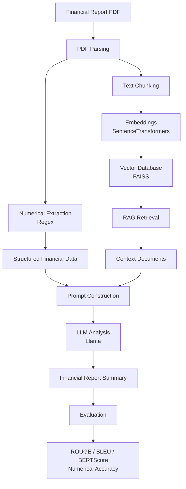

# Financial RAG Analyzer
AI system for financial report analysis using **RAG, numerical extraction, and a local LLM (Llama)**.

AI system for **financial report analysis** using **Retrieval-Augmented Generation (RAG)**, **Llama**, and **rule-based numerical extraction**.

This project focuses on improving the **reliability of financial analysis generated by Large Language Models (LLMs)** by combining **structured numerical extraction** with **RAG-based document understanding**.

---
# Motivation

Financial reports are often released at the same time during earnings seasons, and each report contains a large amount of numerical information such as revenue, profit, and financial ratios.
From my own experience, I found that reading and comparing these reports manually is time-consuming and cognitively demanding.

At the same time, recent research has shown that **small language models (SLMs)** can be efficiently implemented and run even on a **local laptop environment**. This made it possible to experiment with building practical AI systems without relying on large-scale cloud infrastructure.

Motivated by these ideas, I built this project to explore whether a **lightweight LLM-based system** could assist with financial report analysis.

The goal of this project is to investigate how combining:

* **rule-based numerical extraction**
* **Retrieval-Augmented Generation (RAG)**
* **a small LLM (Llama)**

can help generate **structured financial analysis while reducing numerical hallucinations**.

By extracting important numerical values directly from the source document and grounding the LLM with retrieved context, the system aims to improve the **reliability and usability of AI-generated financial analysis**.

---

# Overview

Financial reports contain critical numerical information such as revenue, profit, and financial ratios.

However, Large Language Models often generate **hallucinated numbers** when summarizing financial documents.

To address this problem, this project implements a **hybrid financial analysis pipeline** that combines:

* **Rule-based numerical extraction**
* **Retrieval-Augmented Generation (RAG)**
* **Large Language Models (Llama)**

By extracting key financial metrics directly from the source document and combining them with retrieved context, the system improves the **accuracy and factual reliability of generated financial analysis**.

---

# Key Idea

Instead of allowing the LLM to freely generate numbers, this system:

1. **Extracts numerical financial metrics using regular expressions**
2. **Retrieves relevant document context using RAG**
3. **Provides both numerical data and textual context to the LLM**

This significantly reduces **numerical hallucination** in financial analysis.

---

# Features

* Financial report **PDF parsing**
* **Numerical financial data extraction**
* **RAG-based document retrieval**
* **LLM financial analysis generation**
* **Numerical hallucination mitigation**
* **Automated evaluation with NLP metrics**

---

# Technologies Used

* Python
* Retrieval-Augmented Generation (RAG)
* FAISS (Vector Database)
* LangChain
* Llama (LLM)
* SentenceTransformers
* HuggingFace Transformers
* PyPDF
* Regular Expressions

---

# System Architecture


---

# Example Workflow

1. Upload a financial report PDF
2. Extract numerical financial data
3. Build a vector database from document text
4. Retrieve relevant sections using RAG
5. Generate financial analysis using Llama
6. Evaluate output quality

---

# Example Output

Query:

What are the financial highlights of Toyota for FY2025?

Output:

• Revenue: 48.0 trillion yen
• Pre-tax profit: 6.4 trillion yen
• Net income: 4.7 trillion yen

Main factors:

* Foreign exchange impact
* Cost improvements
* Increased operating expenses

Future outlook:

Toyota plans to promote manufacturing innovation through the **Future Factory project**, focusing on automation and long-term productivity improvements.

---

## Example Queries

The system can analyze financial reports by answering questions such as:

• What are the financial highlights for FY2025?  
• What factors affected Toyota's operating profit this year?  
• What is the company's future outlook described in the financial report?  
• Extract the key financial metrics from the report.  
• Summarize the main business performance factors mentioned in the document.

These queries are answered using a **RAG pipeline combined with numerical extraction**, ensuring that generated responses remain grounded in the original financial documents.

---

# Evaluation Results

The generated financial summaries were evaluated using multiple automatic metrics to measure both **textual similarity** and **numerical consistency**.

| Metric | Score |
|------|------|
| ROUGE-1 | 0.47 |
| ROUGE-2 | 0.24 |
| ROUGE-L | 0.39 |
| BLEU | 0.00 |
| BERTScore (F1) | 0.69 |
| SBERT Similarity | 0.79 |

These results indicate that the generated summaries preserve the **core semantic meaning** of the reference summaries while maintaining **high contextual similarity**.

Note: BLEU scores are low because financial summaries often involve paraphrasing and restructuring of sentences. Therefore, semantic similarity metrics such as **BERTScore** and **Sentence-BERT similarity** provide a more reliable evaluation.

---

### Numerical Accuracy Evaluation

Since financial report analysis requires **high numerical reliability**, additional numerical evaluation metrics were introduced.

| Metric | Score |
|------|------|
| Numerical Exact Match | 1.00 |
| Average Relative Error | 0.00 |

This confirms that the generated summaries **accurately reproduce the numerical values from the original financial documents**, reducing the risk of numerical hallucinations.

---

### LLM-based Evaluation (LLM Judge)

To further verify factual consistency, an additional evaluation step was performed using an LLM-based judge.  
The judge compares the generated answer with the retrieved document context and evaluates numerical consistency and document grounding.

Example evaluation result:


DocNumbers: [48, 367, 64145, 47650]  
AnswerNumbers: [48, 367, 64145, 47650]  
HallucinatedNumbers: []  

Score: 9 / 10  

Reason: The answer correctly reflects the numerical facts and is supported by the retrieved document context.

---

## Research Focus

This project explores how to improve the reliability of financial document analysis using small language models.

The main research questions are:

• Can a **small local LLM (SLM)** generate useful financial analysis without relying on large cloud models?  
• Can **numerical extraction + RAG** reduce hallucinations in financial summaries?  
• How can we evaluate both **textual quality and numerical accuracy** in financial document generation?

To address these questions, the system combines:

- rule-based **numerical extraction**
- **RAG retrieval** for document grounding
- **LLM-based analysis**
- multiple **automatic evaluation metrics**

including semantic similarity metrics and numerical consistency checks.

---

# Installation

Install required dependencies:

```bash
pip install -r requirements.txt
```

---

# Usage

Run the notebook in Google Colab or locally.

Example:

```bash
python main.py
```

Or open the notebook:

```
notebook/analysis.ipynb
```

Upload a financial report PDF and execute all cells.

---

# Project Structure

```
financial-rag-analyzer
│
├ notebook
│   └ analysis.ipynb
│
├ README.md
├ requirements.txt
```

---

# Future Improvements

* Improve numerical extraction accuracy
* Support multiple financial report formats
* Improve RAG retrieval performance
* Add visualization of evaluation results
* Implement structured financial report generation

---

# Research Focus

This project focuses on improving the **factual reliability of LLM-generated financial analysis**.

In particular, it investigates how combining:

- structured numerical extraction
- retrieval-based context grounding
- large language models

can reduce **numerical hallucinations in financial document analysis**.

---

## Limitations

• Numerical extraction currently relies on regular expressions and may fail on complex table structures.  
• The system was tested on a limited number of financial reports.  
• Retrieval quality depends on document chunking and embedding quality.  
• LLM evaluation (LLM Judge) may introduce bias because it is itself a language model.

---

# License

MIT License

---

# Author

Koki Kobayashi

